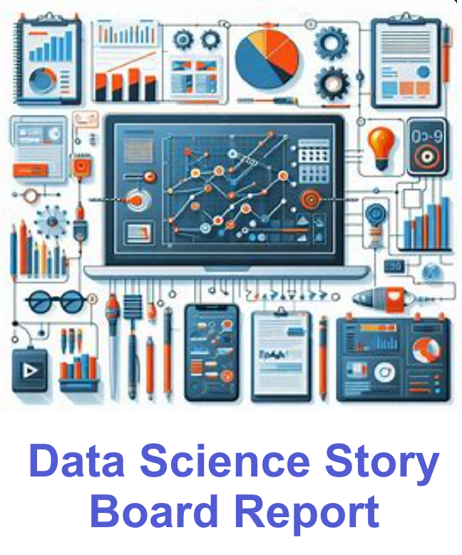
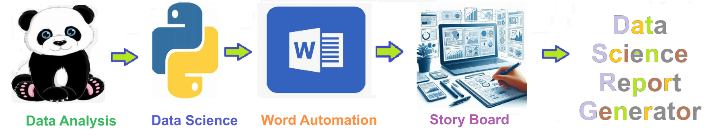

# Data Science Report Generator - This project creates a word document for data science projects that produces a report of the scientific 
This project creates a word document for data science projects that produces a report of the scientific 

This project creates a word document for data science projects that produces a report of the scientific 
process used to analyze the data. 

A **data science report or storyboard** is a tool used to plan, visualize, and communicate the sequence of steps, findings, and insights throughout a data science project. It is particularly valuable for conveying complex analyses and results to both technical and non-technical stakeholders in an organized and engaging manner.

Key Uses of a Data Science Storyboard:
1. **Project Planning**: It helps in outlining the objectives, hypotheses, data sources, and analytical approaches to be used in the project. This can guide the team through the project phases.

2. **Narrative Construction**: A storyboard helps in constructing a clear and compelling narrative around the data analysis. It allows data scientists to tell a story that connects the data, the analysis, and the insights in a logical flow.

3. **Visualization of Findings**: The storyboard provides a framework to visually represent key findings through charts, graphs, and other visual aids, making it easier to understand complex data.

4. **Stakeholder Communication**: It is a crucial tool for communicating progress and results to stakeholders. By presenting data and insights in a structured manner, it ensures that the message is clear and accessible to a wide audience.

5. **Iterative Feedback**: As a living document, the storyboard can be updated as the project progresses, allowing for iterative feedback and adjustments to the analysis or narrative.

6. **Documentation**: It serves as a record of the analytical process and decisions made throughout the project, which can be useful for future reference or for onboarding new team members.

In essence, a data science storyboard bridges the gap between data analysis and actionable insights by providing a coherent and visually appealing narrative.

Sample Table of Contents
1. Introduction

2. Overview of the HEDIS Measure
3. Objective of the Analysis
4. Data Description

**Denominator**: The number of Patients who qualify for the HEDIS measure
**Numerator**: Patients who met and did not meet the measure goal
**Exclusions**: Patients excluded for clinical reasons
Data Sources and Collection Process
Data Analysis

5. Calculation of Compliance Rates (Numerator/Denominator)
6. Exploratory Data Analysis (EDA)
7. Identification of Key Factors Affecting Compliance Results
8. Key Findings (e.g., compliance rates, trends)
9. Visualization of Results (e.g., graphs, charts)

Significance of Results in Healthcare Quality
Analysis of Non-Compliance Causes
Areas Needing Improvement
Recommendations and Conclusion

Actionable Insights to Improve Compliance
Summary and Next Steps
Description of HEDIS Measures:
In HEDIS measures, the Denominator represents the patients eligible for the measure, while the Numerator includes both patients who met and those who did not meet the measure's goal. The Exclusions are patients excluded for clinical reasons. The analysis focuses on the compliance rate derived from the numerator and denominator, highlighting areas for quality improvement in healthcare delivery.

## Getting Started
To get started with the **Data Science Report Generator** solution repository, follow these steps:
1. Clone the repository to your local machine.
2. Install the required dependencies listed at the top of the notebook.
3. Explore the example code provided in the repository and experiment.
4. Run the notebook and make it your own - **EASY !**
    
## Solution Features
- Easy to understand and use  
- Easily Configurable 
- Quickly start your project with pre-built templates
- Its Fast and Automated

## Notebook Features
- **Self Documenting** - Automatically identifes major steps in notebook 
- **Self Testing** - Unit Testing for each function
- **Easily Configurable** - Easily modify with **config.INI** - keyname value pairs
- **Includes Talking Code** - The code explains itself 
- **Self Logging** - Enhanced python standard logging   
- **Self Debugging** - Enhanced python standard debugging
- **Low Code** - or - No Code  - Most solutions are under 50 lines of code
- **Educational** - Includes educational dialogue and background material
    
## Deliverables or Figures
    
    

## Github    
## https://github.com/JoeEberle/ 

## Email 
## josepheberle@outlook.com 

    

    